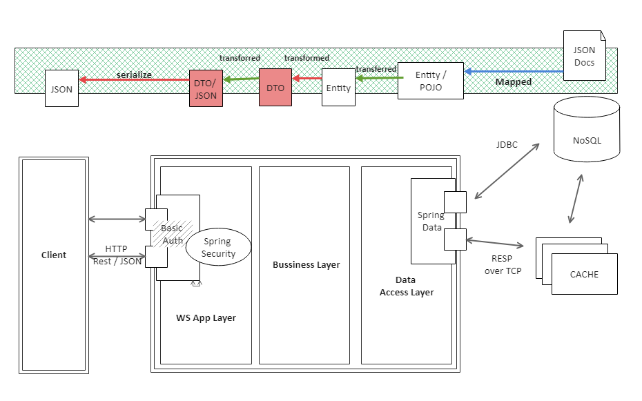
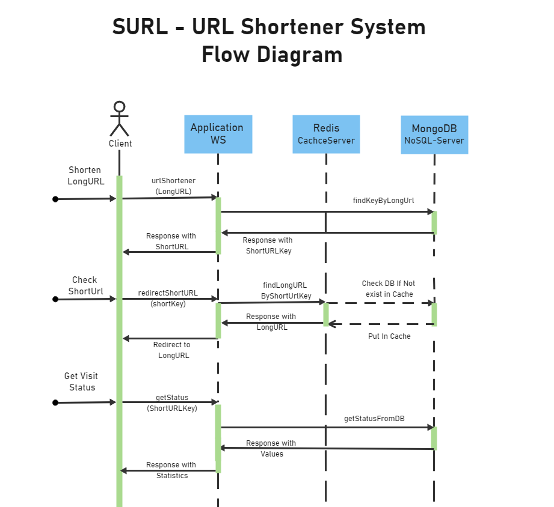
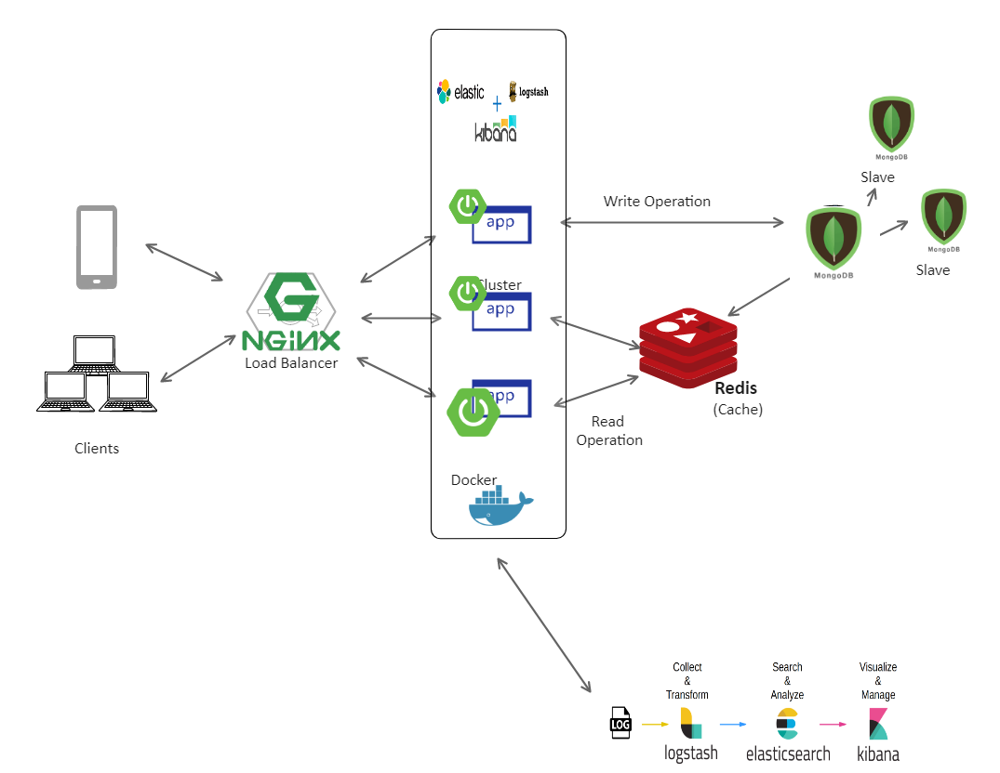

# SUrl
SURL is a URL Shortener System which is horizontally scalable unlimitedly.

In order to develop a new feature for the high traffic messaging service of the company, new URL Shortener system is needed. System should be designed such that it should respond very quickly to millions of requests. In addition, it should be unlimitedly scaled horizontally to meet increasing request traffic in the future.

# System Architecture Diagram


# Message Flow Diagram
You can see the message flow diagram to indicate messaging flow from client to backend systems as below



# High Level Design

Key Components
Following will be the key components in the URL shortening application:
1.	Clients- Web Browsers/Mobile app. It will communicate with the backend servers via HTTP protocol
2.	Load Balancer- To distribute the load evenly among the backend servers
3.	Web Servers- Multiple instances of web servers will be deployed for horizontal scaling
4.	Database - It will be used to store the mapping of long URLs to short URLs
5.	Caching - We know that our database is going to be read heavily. So we have to find some way to speed up the reading process.




### Technology Stack

* Java 8
* Spring Boot
* Spring Data MongoDB
* Spring Security
* JUnit
* Mockito
* Maven
* Docker
* Redis
* MongoDB
* NGINX (Load Balancer)
* Elasticsearch  * *has a issue in feature branch*
* Logstash  * *has a issue in feature branch*
* Kibana  * *has a issue in feature branch*

### Setup and Run

You need to have Java 8 jdk installed on you system.

1. Clone this repository
2. To package jar file and create the app image execute the following command in **surl** directory:
    ```
    mvn clean package docker:build
    ```
3. To run the system:

    ```
    docker-compose up -d 
    ```

4. To shorten a long url:

    ```
    curl -v -H "Content-Type: application/json" -X POST -d '{"longUrl":"www.google.com"}' http://localhost:8080/api/v1/shortener
    ``` 
5. To access your short url: (***SURL*** is the shorted code generated in the 4th step)
    ```
    curl -v -X GET http://localhost:8080/api/v1/{SURL}
    ```
6. To access statistics for a short url with its key:

    ```
    curl -v  -H "Content-Type: application/json" -X GET http://localhost:8080/api/v1/stat/{SURL}
    ```

<meta name="google-site-verification" content="1x4YgcwnsRe-aO_MI77w6YfmPVsKjO9wfzw-0V9dLfY" />
